<!-- Generated by GitHub Profile Agent Console. Edit profile.config.json, then run npm run generate. -->

  <picture>
    <source media="(max-width: 760px) and (prefers-color-scheme: dark)" srcset="./assets/hero/agent-console-9a2d855c-mobile-dark.svg">
    <source media="(max-width: 760px)" srcset="./assets/hero/agent-console-9a2d855c-mobile-light.svg">
    <source media="(prefers-color-scheme: dark)" srcset="./assets/hero/agent-console-9a2d855c-dark.svg">
    <source media="(prefers-color-scheme: light)" srcset="./assets/hero/agent-console-9a2d855c-light.svg">
    
  </picture>

  

## About Me

I build beautiful web and mobile solutions with clean code and modern technology.

Full-stack developer passionate about solving real-world problems through thoughtful software design and implementation.

Currently developing a personal multi-agent AI system (autonomous coding & automation agents) to streamline my own dev workflow.

## Current Focus

| Area | What I am exploring |
| --- | --- |
| **Web Development** | Full-stack TALL stack (Tailwind, Alpine, Laravel, Livewire) with modern patterns and clean architecture. |
| **Mobile Apps** | Cross-platform development with Flutter for iOS and Android, focusing on performance and user experience. |
| **API Design** | RESTful APIs with Sanctum/Passport authentication, solid design patterns, and comprehensive documentation. |
| **AI Agent Development** | Building and orchestrating autonomous AI agents for coding, automation, and workflow assistance — from tool integration to multi-agent coordination. |

## Featured Work

| Project | Focus | Why it matters |
| --- | --- | --- |
| [**PlantGuardian Web**](https://github.com/rendikaadji/plantguardian-web) | Smart plant monitoring system | IoT-integrated plant monitoring dashboard with real-time sensor data visualization, user authentication, and mobile-responsive design. [Live](https://plantguardian.net) |
| [**Casting.id**](https://github.com/rendikaadji/casting.id) | Talent casting platform | Platform connecting actors and filmmakers with user profiles, job listings, secure authentication, and application management. |
| [**Smart Queue**](https://github.com/rendikaadji/smart-queue) | Queue management system | Real-time queue management with analytics, notifications, and admin dashboard for efficient crowd management. |

## Research Direction

I focus on building systems that are not just functional but delightful to use. My approach combines technical excellence with understanding user needs and business requirements.

## Tech Stack

  
  
  
  
  
  
   
  
  
  
  
  
  

## Contributions in the Last Year

  <picture>
    <source media="(prefers-color-scheme: dark)" srcset="https://raw.githubusercontent.com/rendikaadji/rendikaadji/output/github-contribution-grid-snake-dark.svg">
    <source media="(prefers-color-scheme: light)" srcset="https://raw.githubusercontent.com/rendikaadji/rendikaadji/output/github-contribution-grid-snake.svg">
    
  </picture>

  

## GitHub Stats

  
  

  

  

## Recent Activity

<!-- AUTO:ACTIVITY:START -->
_Recent public activity will appear here after the workflow runs._
<!-- AUTO:ACTIVITY:END -->

---

  Building digital solutions — and the AI agents that help build them.

  

