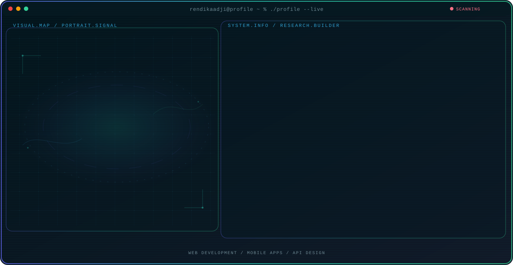

<!-- Profile README. Edited directly (the old generator template still references dead stat services). -->
<p align="center">
  <picture>
    <source media="(max-width: 760px) and (prefers-color-scheme: dark)" srcset="./assets/hero/agent-console-9a2d855c-mobile-dark.svg">
    <source media="(max-width: 760px)" srcset="./assets/hero/agent-console-9a2d855c-mobile-light.svg">
    <source media="(prefers-color-scheme: dark)" srcset="./assets/hero/agent-console-9a2d855c-dark.svg">
    <source media="(prefers-color-scheme: light)" srcset="./assets/hero/agent-console-9a2d855c-light.svg">
    
  </picture>
</p>

<h3 align="center">Full-Stack Developer · Laravel · Flutter · Python · AI Agents</h3>

<p align="center">
  
  
  
  <a href="https://github.com/rendikaadji?tab=repositories"></a>
</p>

---

## 👋 About Me

I build **web and mobile products** end to end, from database and API design to the interface people actually touch.
My daily stack is the **TALL stack** (Tailwind, Alpine, Laravel, Livewire) for the web and **Flutter** for iOS and Android.

Right now I am building a **personal multi-agent AI system**: autonomous coding and automation agents that plug into my own development workflow.

```yaml
role:      Full-Stack Developer
building:  Web apps · Mobile apps · REST APIs · AI agents
approach:  Clean architecture, performance, and UX that feels effortless
learning:  Multi-agent orchestration & ML for automation
```

## 🎯 Current Focus

<table>
  <tr>
    <td width="50%" valign="top">
      <h4>🌐 Web Development</h4>
      TALL stack (Tailwind, Alpine, Laravel, Livewire) with modern patterns and clean architecture.
    </td>
    <td width="50%" valign="top">
      <h4>📱 Mobile Apps</h4>
      Cross-platform Flutter apps for iOS and Android, focused on performance and user experience.
    </td>
  </tr>
  <tr>
    <td width="50%" valign="top">
      <h4>🔌 API Design</h4>
      RESTful APIs secured with Sanctum/Passport, solid design patterns, and clear documentation.
    </td>
    <td width="50%" valign="top">
      <h4>🤖 AI Agent Development</h4>
      Orchestrating autonomous agents for coding, automation, and workflow assistance, from tool integration to multi-agent coordination.
    </td>
  </tr>
</table>

## 🚀 Featured Work

<table>
  <tr>
    <td width="33%" valign="top">
      <h4>🌱 PlantGuardian</h4>
      <br><br>
      IoT plant monitoring dashboard with real-time sensor visualization, authentication, and a mobile-responsive UI. Built with Laravel Livewire.<br><br>
      <a href="https://plantguardian.net"></a>
    </td>
    <td width="33%" valign="top">
      <h4>🎬 Casting.id</h4>
      <br><br>
      Platform connecting actors and filmmakers: profiles, job listings, secure authentication, and application management.<br><br>
      <a href="https://github.com/rendikaadji/casting.id"></a>
    </td>
    <td width="33%" valign="top">
      <h4>⏱️ Smart Queue</h4>
      <br><br>
      Real-time queue management with analytics, notifications, and an admin dashboard for efficient crowd management.<br><br>
      <a href="https://github.com/rendikaadji/smart-queue"></a>
    </td>
  </tr>
</table>

## 🧭 Engineering Philosophy

> I focus on building systems that are not just functional but delightful to use,
> combining technical excellence with a real understanding of user needs and business requirements.

## 🛠️ Tech Stack

<table>
  <tr>
    <td align="right"><b>Backend</b></td>
    <td>
      
      
      
      
    </td>
  </tr>
  <tr>
    <td align="right"><b>Frontend</b></td>
    <td>
      
      
    </td>
  </tr>
  <tr>
    <td align="right"><b>Mobile</b></td>
    <td>
      
      
    </td>
  </tr>
  <tr>
    <td align="right"><b>Database</b></td>
    <td>
      
      
    </td>
  </tr>
  <tr>
    <td align="right"><b>AI &amp; Tools</b></td>
    <td>
      
      
      
      
    </td>
  </tr>
</table>

## 📊 GitHub Insights

<p align="center">
  <picture>
    <source media="(prefers-color-scheme: dark)" srcset="https://raw.githubusercontent.com/rendikaadji/rendikaadji/output/github-contribution-grid-snake-dark.svg">
    <source media="(prefers-color-scheme: light)" srcset="https://raw.githubusercontent.com/rendikaadji/rendikaadji/output/github-contribution-grid-snake.svg">
    
  </picture>
</p>

<p align="center">
  
</p>

<p align="center">
  
</p>

<p align="center"><sub>Stats are self-hosted and refreshed daily by GitHub Actions, so they never break when third-party stat services go down.</sub></p>

## ⚡ Recent Activity

<!-- AUTO:ACTIVITY:START -->
- Sep 27, 2026: pushed 1 commit to [rendikaadji/rendikaadji](https://github.com/rendikaadji/rendikaadji).
- Sep 17, 2026: pushed 1 commit to [rendikaadji/rendikaadji](https://github.com/rendikaadji/rendikaadji).
- Sep 14, 2026: created a branch in [rendikaadji/betawi_quest](https://github.com/rendikaadji/betawi_quest).
- Sep 7, 2026: pushed 1 commit to [rendikaadji/rendikaadji](https://github.com/rendikaadji/rendikaadji).
- Sep 2, 2026: pushed 1 commit to [rendikaadji/rendikaadji](https://github.com/rendikaadji/rendikaadji).
- Sep 2, 2026: created a branch in [rendikaadji/rendikaadji](https://github.com/rendikaadji/rendikaadji).
<!-- AUTO:ACTIVITY:END -->

---

<p align="center">
  <sub>Building digital solutions, and the AI agents that help build them.</sub>
</p>
